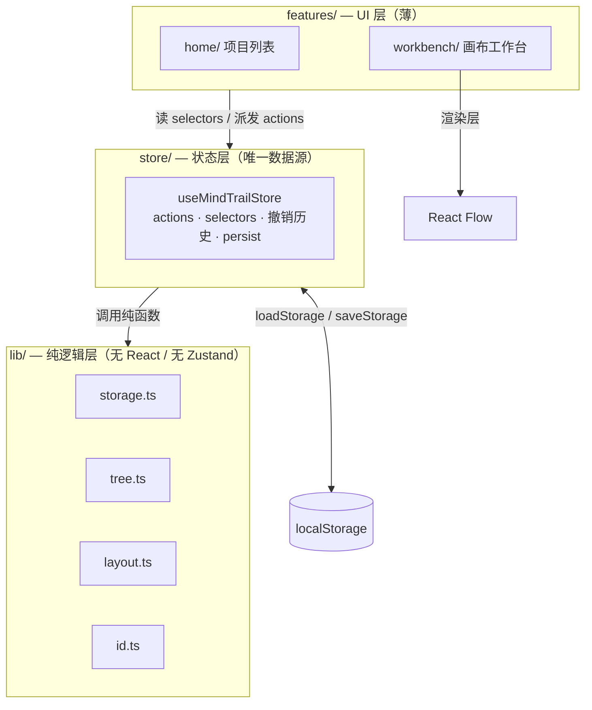
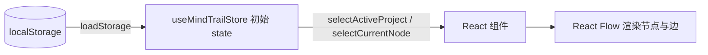
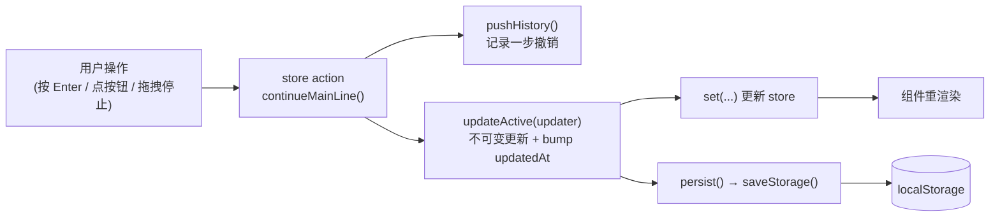
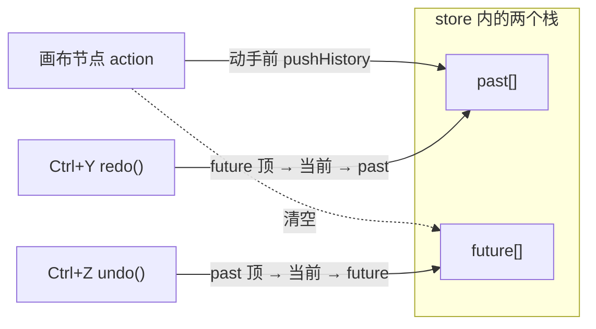

# Mind Trail 架构概览

最后更新：2026-06-26 · 对应版本：v0.1.0

本文从三个角度讲清楚 Mind Trail 是怎么搭起来的：**系统骨架**（整体形态与分层）、**模块怎么分**（每个目录负责什么）、**数据怎么流**（一次操作从点击到落盘再到重绘）。面向想读懂或改动这套代码的人。给 AI / 日常开发的速查见 [`CLAUDE.md`](../CLAUDE.md)，产品行为以 [`PRODUCT_SPEC.md`](PRODUCT_SPEC.md) 为准。

## 1. 系统骨架

Mind Trail 是一个**本地优先的单页应用**：没有后端、没有账号、不联网，所有数据存在浏览器 `localStorage`（key `mind-trail:v0.1.0`）。技术栈是 Vite + React 19 + TypeScript + React Flow（`@xyflow/react`）+ Zustand + Tailwind CSS。

整个应用严格分三层，**依赖方向只能从上往下**（`lib → store → features`），下层永远不认识上层：



这条分层的价值：

- **`lib/` 是纯函数**，不依赖 React 或 Zustand，因此可以脱离 UI 单测 —— 这是项目的 TDD 主战场。
- **`store/` 是唯一数据源**。所有领域状态（项目、节点、边、当前节点、撤销历史）都在这一个 Zustand store 里，任何变更都是这里的一个 action。
- **`features/` 很薄**，只做两件事：把 store 的状态渲染出来、把用户操作派发成 action。它不持有「真实」状态。

一个刻意的约束：**React Flow 只是渲染层**，store 始终权威。画布上的拖拽、缩放是 React Flow 在管，但节点/边/位置的真相在 store 里（详见 §4.3）。

## 2. 模块怎么分

```text
src/
  lib/                      纯逻辑（TDD 主战场）
    storage.ts              localStorage 读写、默认项目/节点工厂、坏数据兜底
    tree.ts                 基于边表的 getChildren / getParentId / getDescendants
    layout.ts               建节点定位（mainChildPosition/branchChildPosition）+ autoLayout 全图重排
    id.ts                   生成唯一 id
  store/
    useMindTrailStore.ts    唯一 Zustand store：状态 + 所有 action + selectors + 同步持久化 + 撤销/重做
  features/                 UI 层
    home/
      ProjectHome.tsx       项目列表：新建 / 打开 / 删除
      ConfirmDialog.tsx     删除项目的二次确认弹窗
    workbench/
      Workbench.tsx         用 <ReactFlowProvider> 包住工作台，装配 Toolbar/Canvas/Inspector
      Toolbar.tsx           顶部栏：返回列表、项目标题、自动整理布局、回到当前节点
      Canvas.tsx            React Flow 画布；store ↔ RF 双向同步的关键所在
      TrailNodeView.tsx     自定义节点：四个连接点 handle、状态色块 + 圆点、双击行内改标题
      Inspector.tsx         右侧面板：标题 / 状态 / 笔记 / 继续主线 / 创建支线 / 删除
      useKeyboardShortcuts.ts  全局快捷键：Enter/Tab/Delete/Backspace、Ctrl+Z/Ctrl+Y
  types.ts                  共享类型：TrailNode / TrailEdge / MindTrailProject / MindTrailStorage
  App.tsx                   仅凭 activeProjectId 路由：有则 <Workbench/>，否则 <ProjectHome/>
  main.tsx                  React 入口
```

**路由没有 router 库**：[`App.tsx`](../src/App.tsx) 只看 `activeProjectId` —— 非空就进工作台，空就回项目列表。因为 `activeProjectId` 也被持久化，「下次启动自动打开上次的项目」就免费得到了。

## 3. 核心数据模型

一切围绕**节点 + 边表**。边带 `type` 区分主线（`main`，向下）和支线（`branch`，向右）。完整结构见 [`types.ts`](../src/types.ts)：

```ts
type TrailNode  = { id; title; status; note; x; y }
type TrailEdge  = { id; from; to; type: 'main' | 'branch' }
type MindTrailProject = { id; title; currentNodeId; nodes[]; edges[]; createdAt; updatedAt }
type MindTrailStorage = { version: '0.1.0'; activeProjectId; projects[] }
```

几条始终成立的不变量：

- 每个项目**至少有一个节点**；`currentNodeId` 永远指向一个存在的节点。
- 删除节点 = **删除该节点及其所有后代**，并清理相关边（删子树）。删完后当前节点优先落到父节点。
- 主线子节点与父节点同列、正下方；支线子节点在父节点右侧一列。
- 持久化的存储对象**不包含撤销历史** —— 历史只活在内存里（见 §4.4）。

## 4. 数据怎么流

### 4.1 读路径（启动）



模块加载时 `loadStorage()` 读一次 localStorage 作为 store 初始值；解析失败或版本不符时回退到空存储（坏数据兜底）。组件用 `selectActiveProject` / `selectCurrentNode` 等 selector 订阅，store 一变就重渲染。

### 4.2 写路径（一次操作）

所有领域变更都走同一条链路。以「继续主线」为例：



要点：

- **节点 action 隐式作用于「当前激活的项目」**，通过 `updateActive()` 这个辅助函数完成；项目生命周期 action（create/open/close/delete/rename）则显式传项目 id。
- **每一次变更都同步写 localStorage**（`persist()` 内无防抖）。这正是「刷新不丢」可靠的原因，不要改成异步/防抖。
- **更新都是不可变的**（`.map` / 展开运算符生成新数组）。这一点也是撤销能廉价实现的前提（§4.4）。

### 4.3 画布 ↔ store 同步（最微妙的一块）

[`Canvas.tsx`](../src/features/workbench/Canvas.tsx) 把 React Flow 当**纯渲染层**，store 始终权威：

- **store → RF**：用一个 effect，按「节点位置/数据 + 当前节点」的序列化结果做 key，把 store 同步到 RF 本地节点。同步是**合并**（`...prevById.get(id)`）而不是整体替换 —— 因为要保住 RF 已经测量出来的 `handleBounds`，否则按 handle 绑定的边会解析不出来被悄悄丢弃（警告 `#008`）。
- **RF → store**：拖拽时只更新 RF 本地状态保证流畅，**在拖拽结束（drag-stop）才提交回 store**（`moveNode`）。绝不要反过来让 RF 成为真相来源。
- **边绑定具名 handle**：每个节点暴露 `top`/`left`（目标）与 `bottom`/`right`（源）四个 handle。主线连 `bottom → top`，支线连 `right → left`，两者都带箭头。
- RF 的测量是 `requestAnimationFrame` 驱动的，所以在后台/隐藏标签页里不会跑。

### 4.4 撤销 / 重做（会话级历史）

撤销建立在「所有 action 都是不可变更新」之上，因此一步历史只是对旧数组的**引用快照**，几乎零成本。



设计要点：

- **快照是「项目级」的**：只存当前项目的 `nodes / edges / currentNodeId`，不存标题 —— 所以撤销不会回退「重命名项目」，也不影响别的项目。
- **覆盖范围**：画布节点操作（删除、继续主线、创建支线、改状态、拖拽、自动整理布局、改标题/笔记）。项目级操作不纳入；**切换/新建/删除项目会清空历史**，让撤销范围始终是「当前项目本次编辑」。
- **合并连续编辑**：靠一个 `historyTag`，把对同一节点同一字段的连续文字输入合并成一步，避免逐字符撤销。
- **会话级**：`past/future` 不写进持久化存储，刷新后从空栈开始（撤销历史本就不该跨刷新存活）；但撤销/重做**本身的结果会落盘**，所以撤销后刷新仍保持撤销后的状态。
- **键位**：Ctrl/⌘+Z 撤销，Ctrl/⌘+Shift+Z 或 Ctrl+Y 重做。在输入框里打字时这些键被让给浏览器原生的文本撤销（[`useKeyboardShortcuts`](../src/features/workbench/useKeyboardShortcuts.ts) 的 `isTypingTarget` 守卫）。

## 5. 测试策略

只做**逻辑层 TDD**：`lib/` 是纯函数、`store/` 的 action 也有完整测试，**刻意不写组件/渲染测试、不引 jsdom**。Vitest 跑在快速的 `node` 环境，用 [`src/test/setup.ts`](../src/test/setup.ts) 里的 `localStorage` polyfill。store 测试通过 `localStorage.clear()` + `setState` 重置来互相隔离。UI（画布同步、快捷键）靠手动/浏览器验证，不进单测。

## 6. 一句话总结

> 纯逻辑可单测、状态单一可信、UI 只管渲染、每步操作即时落盘、撤销让误操作可回退 —— 在不给画布添乱的前提下，把「主线清楚、支线可控、当前节点明显、刷新不丢」做扎实。
